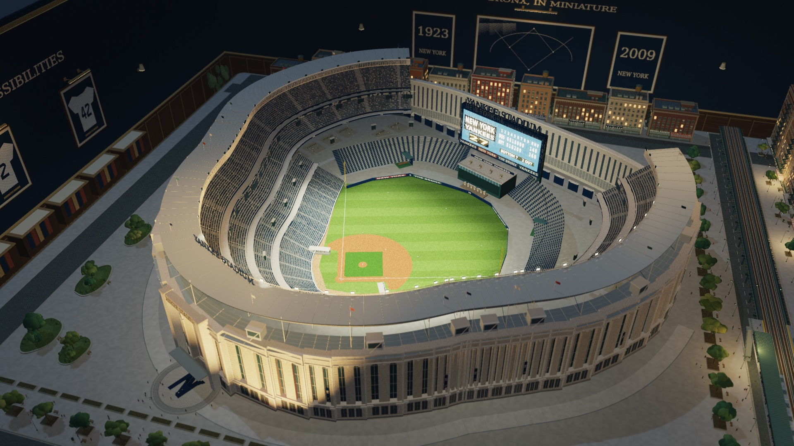
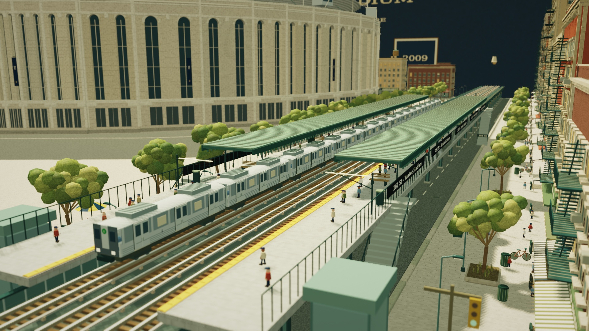
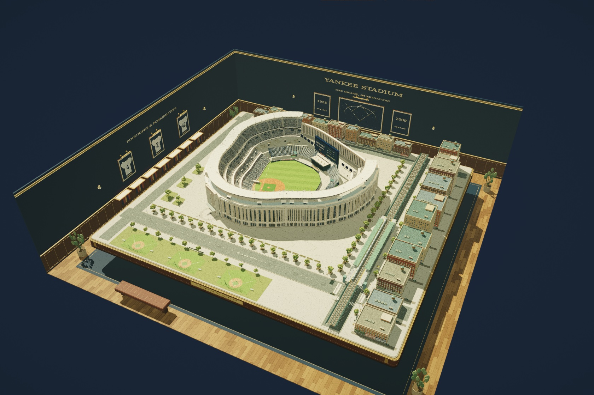
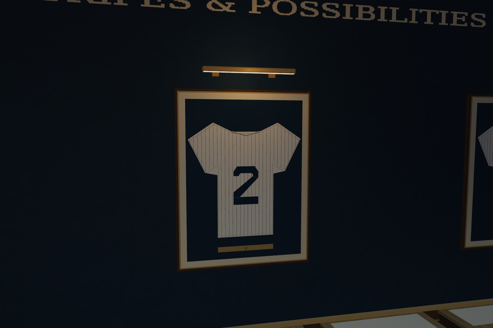

# The Bronx Gallery

Open **The Bronx Gallery** in the house directory, select **west-4** on the
live map, or visit `index.html?room=yankee`. Choose **Night run** in Lighting
for the floodlit ballpark and warm River Avenue windows. The room lamp dimmer
controls the gallery lamps independently of the stadium and street lights.

The room brings nickfromlater's approved standalone miniature into the native
Whistlevale renderer. Proposal: [#34](https://github.com/nickfromlater/whistlevale/issues/34).
It uses the existing navigation, camera, lighting, throttle, pause, train cabinet,
credits panel and playable HTML exporter. No guest renderer, iframe, external
assets, runtime fonts or new browser dependencies are required for this room.

## The model

The current Yankee Stadium, interpreted as a handcrafted model railroad display:
four seating tiers, 35,829 individual seats, white frieze and roof trusses,
limestone window bays, the Great Hall, scoreboard, bleachers, bullpens, Monument
Park and Heritage Field. The compressed neighborhood has masonry buildings,
fire escapes, rooftop water tanks, awnings, vendors, benches and 467 miniature
figures, plus small seated crowd marks.

The field uses 0.136 scene units per foot. The 90-foot base square and 60.5-foot
pitching distance share that scale with the published 318 / 399 / 408 / 385 / 314
foot field anchors. These anchors are dimensional; the outer building, seating
count and surrounding street edges are modelmaking interpretations, not a
survey or an exact seat-by-seat reproduction. Diagonal mowing bands are native
polygons clipped to the grass, underneath the clay.

The three-track River Avenue structure models the elevated **4** service at
161 St–Yankee Stadium. The **B/D** service is represented on the gallery diagram;
those trains run underground and are not placed on the elevated tracks.

Two R142-family ten-car formations run opposite services. They slow into the
station, berth completely within the platforms, open the platform-side doors,
close them before departure, then accelerate away. The shared throttle scales
the timetable; pause holds its state. Bogies, rotating wheelsets, roofs and door
leaves reuse ten small meshes. Roof cutaway also exposes the interior benches
and grab poles. When both services are outside the display, the follow camera
waits at the platform. The clipped staging beyond the board edges is a theatrical
model railway return, not a modeled closed Bronx track circuit.

The train cabinet names the actual running subway. After choosing another train,
**Restore room train** returns the ten-car River Avenue Local at its current
timetable position, with the door state and opposite service preserved. The
restored default carries through saved preferences and playable exports.

Cinema opens **Over the ballpark**, with three other room-specific views:
**The station platform**, **The Bronx in miniature**, and **Along the elevated**.
The platform view waits beside the station; the following view travels with the
train while staying on the display. Dragging and zooming still take over the
camera, and leaving cinema restores the previous view and controls.

## The gallery and night lighting

Walnut trestles support the brass-trimmed display cabinet. Navy walls and walnut
paneling surround a woven runner, a reading bench and potted plants. Framed
pinstriped jerseys, a field blueprint, 1923 / 2009 prints, a subway diagram,
pennants, books and individually stitched display baseballs dress the room.
Ceiling beams and pendants lift away in high aerial views; close views retain
them. Brass sconces, pendant lamps and picture lights use the room dimmer. The jersey
pinstripes follow the shoulders and sleeves, with individually cut block numerals,
stitches, hem seams and small brass number plates.

Six aimed stadium floodlights illuminate the grass and seating. Two warm
uplights pick out the limestone facade; localized platform and street lighting
and lit city windows surround the field. The native HDR bloom supplies the light
glow, including the illuminated scoreboard. Floodlight positions, directions and
falloff radii follow the actual room transform on the live map. Other rooms
receive zero floodlight strength.

The larger display has a proportional near plane in room and cinema views, a
1,600-unit far plane, and matching depth reconstruction in the macro lens pass. Its actual footprint
is 292 × 282 units at map scale 0.22. The stable west-4 plot preserves the newly
merged Yamaai room's place in the east wing.

## Ownership and checks

Original model, gallery, subway and visual direction: **nickfromlater**, built
with agent assistance. Code is covered by the repository's MIT license. Sign
lettering is baked into geometry; no font binary or photographic texture is
distributed. Earlier house and renderer credits remain intact.

Architectural and dimensional references:

- [Populous: Yankee Stadium](https://populous.com/showcases/yankee-stadium)
- [MLB: Yankee Stadium guide](https://www.mlb.com/news/featured/yankee-stadium-guide-capacity-seating-chart-parking-and-more)
- [161st Street–Yankee Stadium station](https://en.wikipedia.org/wiki/161st_Street%E2%80%93Yankee_Stadium_station)

`npm run test:yankee` checks emitted geometry and footprint, field scale, station
berths, door interlocks, throttle stop, staging, complete formations, wheel and
roof drawing, restoring the original subway without resetting its timetable,
mapped lighting, public credit, and mesh disposal on replacement
and failed construction. It runs with a 192 MiB Node heap limit to catch a return
to unbounded construction. The full room has a fixed 5.1-million-vertex ceiling;
existing contribution and Hall budgets are unchanged. Static room construction
is cached and there is no geometry generation in the frame loop.

The static model uploads in 76 batches, each containing at most 65,535 vertices.
The numeric construction array holds at most 786,420 values (about 6 MiB of
numeric payload), instead of 59,411,952 values (about 453 MiB before capacity,
Float32 conversion and indexing). All original triangles remain. Small indices
and omission of identically zero texture coordinates reduce room, wall and stock
GPU buffers from approximately 140 MiB to **111.71 MiB**. This excludes renderer
targets, textures and other rooms. Batches outside the camera or shadow frustum
are skipped; entering this room caps rendering at 60 FPS. Other rooms retain
their existing cadence. Completed buffers are released on cache replacement or
failed construction.

Focused Chrome testing on an Apple M4 Pro covered desktop, 390px and 320px
layouts, day/night cinema, train selection/restoration, the live map and travel
to Alder Valley and Yamaai. It also found and fixed a map-stopping floodlight
cache error when drawing the shared house shell. Revised browser heap samples
varied widely, from about 77 to 748 MiB depending on garbage collection and page
visits. They are not peak or live-memory measurements; the bounded construction
array and actual GPU buffer sizes above provide the repeatable comparison.
Construction still blocks for several seconds on first entry. This change does
not claim asynchronous loading or physical-phone stability.

`npm test` and the full geometry comparison passed. The comparison retained
15,400,122 vertices and checked 184,801,464 Float32 attributes bit for bit across
567 meshes. Automated export, persistence and credit checks passed. Physical
phone testing and playback of a downloaded standalone export remain unverified.

Selected review images are in `docs/rooms/yankee-preview/`; the complete local
geometry measurements, checks and render receipts remain under ignored
`evidence/yankee-room/` and `evidence/pr35-performance/`.

The first three images are captures from a focused Chrome WebGL 2 tab, without
the browser UI. The jersey detail is the earlier Mesa EGL review render.
